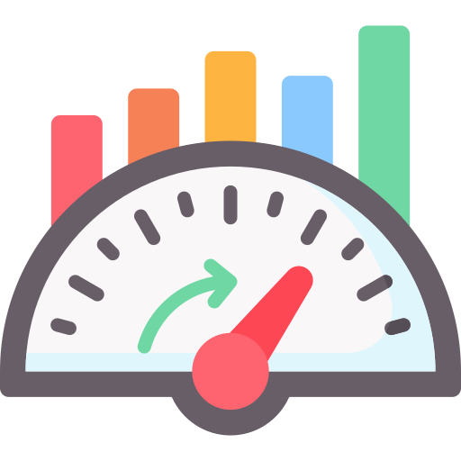

<div id="top"></div>
<!--
*** Thanks for checking out the Best-README-Template. If you have a suggestion
*** that would make this better, please fork the repo and create a pull request
*** or simply open an issue with the tag "enhancement".
*** Don't forget to give the project a star!
*** Thanks again! Now go create something AMAZING! :D
-->


<!-- PROJECT SHIELDS -->
<!--
*** I'm using markdown "reference style" links for readability.
*** Reference links are enclosed in brackets [ ] instead of parentheses ( ).
*** See the bottom of this document for the declaration of the reference variables
*** for contributors-url, forks-url, etc. This is an optional, concise syntax you may use.
*** https://www.markdownguide.org/basic-syntax/#reference-style-links
-->
[![Contributors][contributors-shield]][contributors-url]
[![MIT License][license-shield]][license-url]


<!-- PROJECT LOGO -->
<br />
<div align="center">
  <a href="https://github.com/gabecarra/GDL_Project">
    
  </a>

  <h3 align="center">Benchmarking similarity-based graph construction methods</h3>

  <p align="center">
    Graph Deep Learning SP 2022 - Project
    <br />
  </p>
</div>


<!-- TABLE OF CONTENTS -->
<details>
  <summary>Table of Contents</summary>
  <ol>
    <li>
      <a href="#about-the-project">About The Project</a>
      <ul>
        <li><a href="#built-with">Built With</a></li>
      </ul>
    </li>
    <li><a href="#usage">Usage</a></li>
    <li><a href="#license">License</a></li>
    <li><a href="#contact">Contact</a></li>
    <li><a href="#acknowledgments">Acknowledgments</a></li>
  </ol>
</details>


<!-- ABOUT THE PROJECT -->
## About The Project

[//]: # ([![Product Name Screen Shot][product-screenshot]]&#40;https://example.com&#41;)

Often the graph has to be extracted from data using some time-series similarity method (e.g., Pearson correlation, Granger causality, correntropy, etc). This project consists in benchmarking the effectiveness of the different similarity scores in extracting graphs that are useful for time series forecasting with GNNs.

<p align="right">(<a href="#top">back to top</a>)</p>


### Built With

* [Python](https://www.python.org)
* [Anaconda](https://www.anaconda.com)
* [Numpy](http://numpy.org)
* [Pandas](https://pandas.pydata.orgkeras)
* [Keras](https://keras.iotensor)
* [Tensorflow](https://www.tensorflow.org)
* [Spektral](https://graphneural.network)
* [Matplotlib](https://matplotlib.orgsea)
* [Seaborn](https://seaborn.pydata.org)
* [scikit-learn](https://scikit-learn.org/stable/scip)
* [scipy](https://scipy.orgtq)
* [tqdm](https://tqdm.github.io)
* [statsmodels](https://www.statsmodels.org/stable/index.html)
* [fastdtw](https://pypi.org/project/fastdtw/)


<p align="right">(<a href="#top">back to top</a>)</p>


<!-- GETTING STARTED --
## Getting Started

This is an example of how you may give instructions on setting up your project locally.
To get a local copy up and running follow these simple example steps.

### Prerequisites

This is an example of how to list things you need to use the software and how to install them.
* npm
  ```sh
  npm install npm@latest -g
  ```

### Installation

_Below is an example of how you can instruct your audience on installing and setting up your app. This template doesn't rely on any external dependencies or services._

1. Get a free API Key at [https://example.com](https://example.com)
2. Clone the repo
   ```sh
   git clone https://github.com/your_username_/Project-Name.git
   ```
3. Install NPM packages
   ```sh
   npm install
   ```
4. Enter your API in `config.js`
   ```js
   const API_KEY = 'ENTER YOUR API';
   ```

<p align="right">(<a href="#top">back to top</a>)</p>


<!-- USAGE EXAMPLES -->
## Usage

In order to start the entire benchmark, is sufficient to execute the ```main.py``` file, which is set up to be ready to go.
If you want to try some other methods, is sufficient to add them on the main 
<p align="right">(<a href="#top">back to top</a>)</p>


<!-- ROADMAP --
## Roadmap

- [x] Add Changelog
- [x] Add back to top links
- [ ] Add Additional Templates w/ Examples
- [ ] Add "components" document to easily copy & paste sections of the readme
- [ ] Multi-language Support
    - [ ] Chinese
    - [ ] Spanish

See the [open issues](https://github.com/othneildrew/Best-README-Template/issues) for a full list of proposed features (and known issues).

<p align="right">(<a href="#top">back to top</a>)</p>


<!-- CONTRIBUTING --
## Contributing

Contributions are what make the open source community such an amazing place to learn, inspire, and create. Any contributions you make are **greatly appreciated**.

If you have a suggestion that would make this better, please fork the repo and create a pull request. You can also simply open an issue with the tag "enhancement".
Don't forget to give the project a star! Thanks again!

1. Fork the Project
2. Create your Feature Branch (`git checkout -b feature/AmazingFeature`)
3. Commit your Changes (`git commit -m 'Add some AmazingFeature'`)
4. Push to the Branch (`git push origin feature/AmazingFeature`)
5. Open a Pull Request

<p align="right">(<a href="#top">back to top</a>)</p>


<!-- LICENSE -->
## License

Distributed under the MIT License. See `LICENSE.txt` for more information.

<p align="right">(<a href="#top">back to top</a>)</p>


<!-- CONTACT -->
## Contact

Gabriel Henrique Carraretto - carrag@usi.ch
Michele Damian - damiam@usi.ch 
Riccardo Corrias - corrir@usi.ch

Project Link: [https://github.com/gabecarra/GDL_Project](https://github.com/gabecarra/GDL_Project)

<p align="right">(<a href="#top">back to top</a>)</p>


<!-- ACKNOWLEDGMENTS -->
## Acknowledgments
* <a href="https://www.flaticon.com/free-icons/benchmark" title="benchmark icons">Benchmark icons created by Freepik - Flaticon</a>
* [Img Shields](https://shields.io)

<p align="right">(<a href="#top">back to top</a>)</p>


<!-- MARKDOWN LINKS & IMAGES -->
<!-- https://www.markdownguide.org/basic-syntax/#reference-style-links -->
[contributors-shield]: https://img.shields.io/github/contributors/gabecarra/GDL_Project?style=for-the-badge
[contributors-url]: https://github.com/gabecarra/GDL_Project/graphs/contributors
[license-shield]: https://img.shields.io/github/license/gabecarra/GDL_Project?style=for-the-badge
[license-url]: https://github.com/gabecarra/GDL_Project/blob/master/LICENSE.txt
[product-screenshot]: images/screenshot.png
